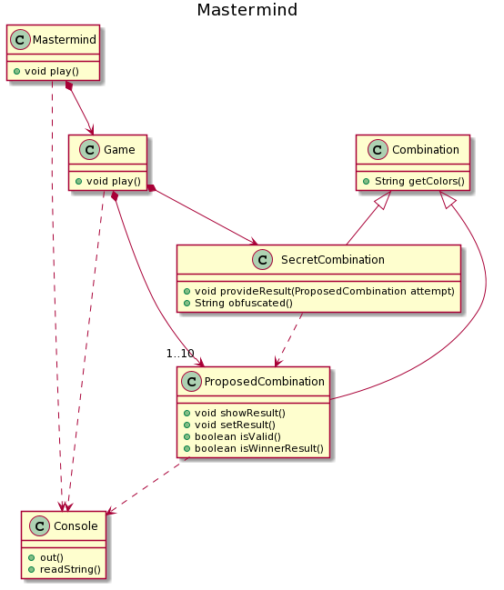

## Código
[/src/mastermind](https://github.com/Master-Desarrollo-20-21/ejercicio-3-codigo-de-mastermind-herencia-nihillo/tree/main/src/mastermind)

## Diagrama de vista pública de clases actualizado
(ver [Ejercicio 2](https://github.com/Master-Desarrollo-20-21/ejercicio-2-vista-publica-clases-mastermind-nihillo))

